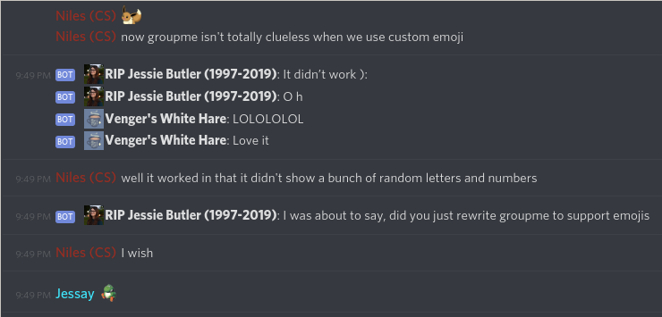

# LeslieBot is no longer used, see [LeslieBot 2](https://github.com/nilesr/LeslieBot2)

## LeslieBot is a GroupMe ↔ Discord bridge

### Set Up

Install prerequisites: discord.py **rewrite branch**, `python-gobject`, `BTEdb` and `pillow`

Install and configure [mako-server](https://github.com/nilesr/mako-server) such that you can receive API posts

Install `index.pyhtml` to somewhere publicly accessible via mako-server.

Install `xyz.niles.LeslieBot.conf` to `/etc/dbus-1/system.d/xyz.niles.LeslieBot.conf` and reload or restart dbus.

In the developer portals for the two services, create a discord bot and GroupMe bot. For the GroupMe bot, set your callback url to the publicly accessible url of the `index.pyhtml` that you installed earlier.

Put your discord bot access token in the `client.run` call at the bottom of `leslie-bot.py`

Put your personal GroupMe access token, GroupMe bot ID, and the discord guild ID and channel ID to mirror in the variables at the top of `leslie-bot.py`

Add your GroupMe bot to the right group, and add the Discord bot to the right guild. The discord bot wants permission to view channels, read messages, send messages, send messages with embeds and images, and **manage custom emoji** (see the emoji section).

### Running

Just run `leslie-bot.py`. It will connect to discord, and also acquire the `xyz.niles.LeslieBot` bus name.

When a discord message is received, it will POST a message to the GroupMe bot API to send that message to the GroupMe channel. If the post contains an uploaded image, it will download the image and re-upload it to the GroupMe image service API.

When a GroupMe message is sent, GroupMe will send a POST request to the callback URL that you specified, the URL of `index.pyhtml`. `index.pyhtml` will then connect to dbus and invoke `RecvMessage` on `xyz.niles.LeslieBot`, passing it the json-encoded blob as an argument. The glib main loop, which is running on a background thread of `leslie-bot.py`, will then use the main thread's event loop to execute the global `RecvMessage` function in the async context that discord.py expects.

The personal access token is used for uploading images to GroupMe

#### Custom Emojis

The first time someone speaks in GroupMe, LeslieBot downloads their profile picture, resizes it to 32x32 and creates a custom emoji for them. If they change their profile picture, it will delete the old one and create a new one. If there are too many emojis in the guild (the default limit is 50), **it will crash**. You can replace the entirety of the `get_emoji` function with `return ""` to disable this feature. 

If you rename the custom emojis it will probably stop working until the user changes their profile picture. This is a design deficiency, not a technical problem, because I realized there was an easier way to store and retrieve the emojis way after I implemented it, but I'm too lazy to fix it.

If a user uses a custom emoji in the discord server, like :eevee:, it sends it to groupme as "(eevee emoji)"

### Known bugs and mitigations

- **Percent signs** If a bot tries to send a message with a percent sign (%) in it, GroupMe explodes and sends back a 500 error. Never figured out what causes this, but the bot will send 0⁄0 instead, which appears in most clients as the fraction 0/0 (may look vaguely like ⁰/₀). It prepends and appends a zero-width space, so 100% does not appear as ¹⁰⁰⁰/₀. This works unless someone sends more than two % characters in a row, I didn't really feel that it was worth fixing.

- **Formatting** Discord supports italics, bold, and italics and bold using markdown, so \*italics\* for *italics*, \*\*bold\*\* for **bold**, and \*\*\*all three\*\*\* for ***all three***. GroupMe does not support this, but the bot will attempt to use some more obscure unicode codepoints to force it, like 𝘪𝘵𝘢𝘭𝘪𝘤𝘴, 𝗯𝗼𝗹𝗱, and 𝙗𝙤𝙡𝙙 𝙞𝙩𝙖𝙡𝙞𝙘𝙨. Some people with iPhones cannot see these symbols. If that's a problem, replace the implementation of `format` with just `return text;`. It also supports discord underline (`__`), underlined italics (`___`), and strikethrough (`~~`) by using combining underline and combining strike through characters.

